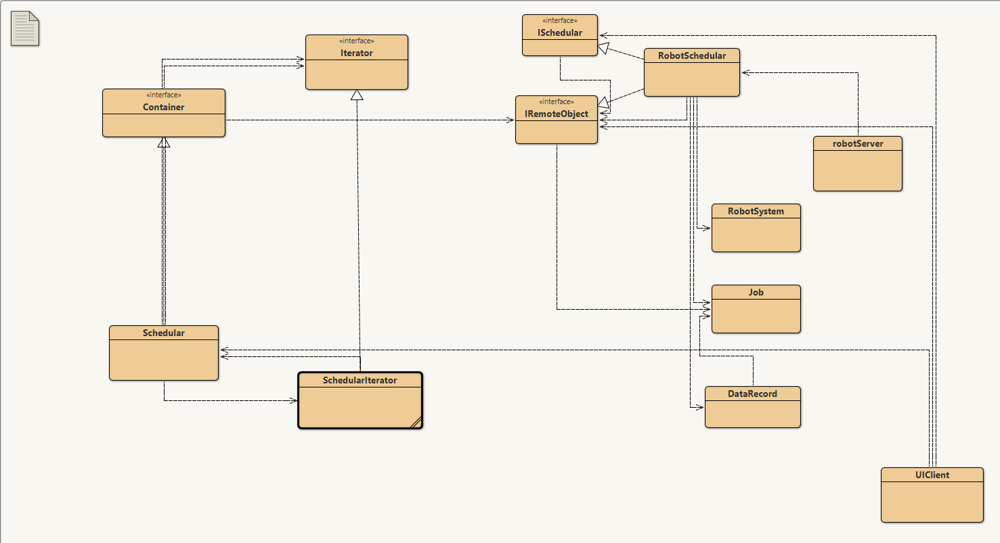

# Java Rmi Project

Project is related to study purpose completed to demonstrate the knowledge of Software engineering
using design patteren, Use case, requirements and sequences.
## Diagram of Project

